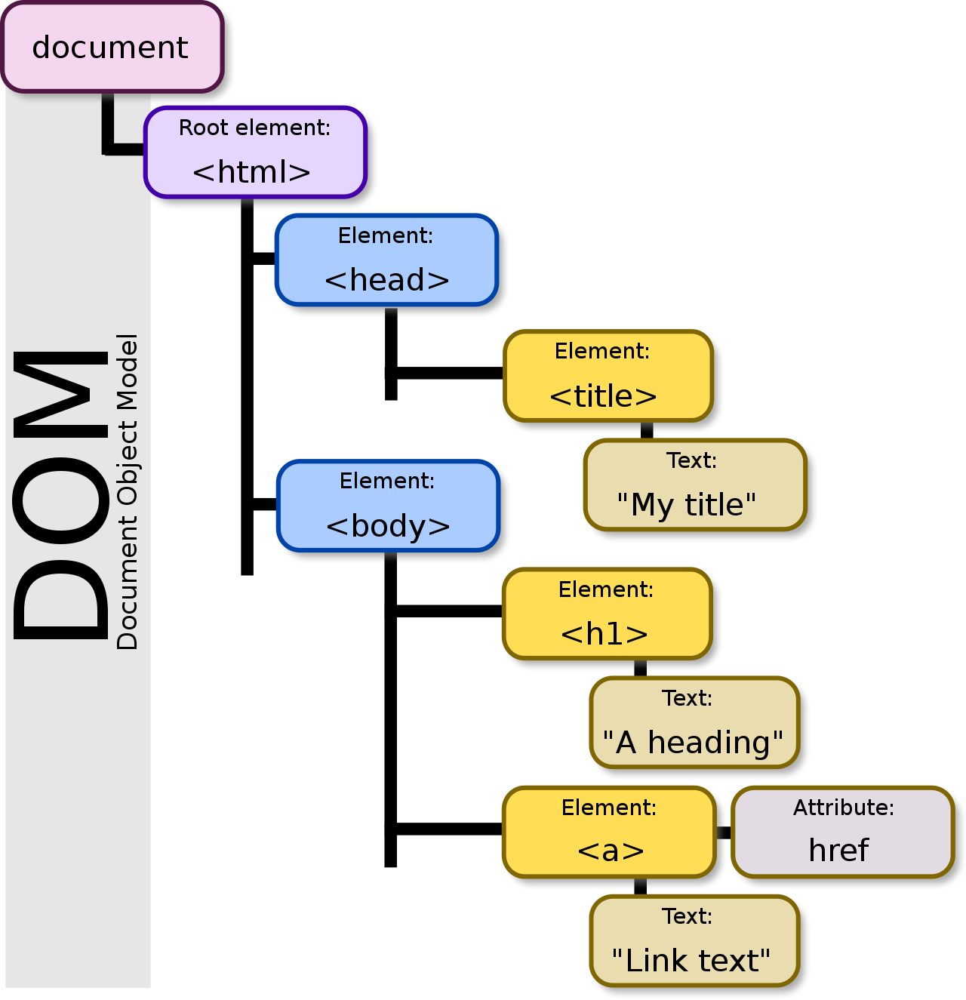

```toc
exclude: Table of Contents
from-heading: 1
to-heading: 5
```

# 1. 웹 작동원리

## 1-1. 프로그램

우리가 컴퓨터 프로그래밍 언어(c, java, javascript 등)으로 작성한 코드들의 집합을 `프로그램`이라고 부른다.

> js 로 작성한 계산기 프로그램 // calculator.js

그리고 이 프로그램이 프로그램을 실행할 수 있는 환경에서 실행되어 실제로 동작하게 되면 프로그램은 `프로세스`가 된다.

> nodeJS로 프로그램을 실행 // node calculator.js

이 환경은 보통 컴퓨터가 해주며 이 실행되어지는 프로세스에는 `포트`를 통해 접근할 수 있다.

그리고 포트를 통해 접속한 프로세스에서는 `스레드`라는 작업흐름 단위를 통해 코드를 읽고 일을 수행한다.

## 1-2. 인터넷, 웹, HTTP

우리는 인터넷을 통해 전세계에 많은 프로그램에 접근할 수 있다.

`인터넷`은 TCP/IP라는 통신 프로토콜(패킷이라는 자그마한 단위를 통해 정보들을 전송할 수 있게 만들어놓은 규칙)을 이용해 정보를 주고받는 컴퓨터 네트워크이다. 이 인터넷 덕분에 와이파이로 카톡을 보내고 컴퓨터로 게임을 할 수 있게 되었다.

비슷한 개념으로 `웹`은 이러한 인터넷이라는 하나의 환경을 통해 사람들이 정보를 공유할 수 있는 전 세계적인 정보 공간을 의미한다.

> 인터넷이라는 기술로 우리는 웹을 사용한다!

우리는 웹에서 `HTTP`(HyperText Transfer Protocol) 통신프로토콜을 이용해 하이퍼텍스트(정보의 형태)를 주고 받는다. 대표적으로 하이퍼텍스트를 작성하는 언어가 `HTML`(HyperText Markup Language)이다.

> HTTP통신으로 HTML을 주고받을 수 있게 됨!

## 1-3. 브라우저, 클라이언트, 서버

우리는 일반적으로 엔드유저로서 `브라우저`라는 프로그램을 사용해 웹에 접근한다.

브라우저는 `Url`을 통해 전세계에 흩뿌려져 있는 프로그램이 담긴 컴퓨터의 프로세스에 포트를 통해 접근한다.

> 포트 표준 HTTP:80 / HTTPS:443

표준 포트를 사용했으면 보통 url에서 포트번호를 생략한다.

프로그램이 담긴 컴퓨터 중 요청을 응답해주는 역할을 하는 컴퓨터를 `서버` , 서버에 요청을 보내는 역할을 하는 것을 `클라이언트` 라고 한다.

> 말그대로 client 는 요청을 하는 고객이고 server 는 서비스를 제공한다. ('serve' + er)

## 1-4. 프론트 서버, 백엔드 서버

서버는 사용자에게 html을 던져주거나, 데이터베이스의 자료를 가져오는 등 다양한 역할을 하는데, 서버의 역할에 따라 서버를 분리하기도 한다.

**브라우저 -> 컴퓨터1 -> 컴퓨터2**

> 요청형태에서 컴퓨터1은 클라이언트의 역할도 서버의 역할도 함.

위의 컴퓨터1을 `프론트 서버`로, 컴퓨터2를 `백엔드 서버`로 명명했을 때,

프론트서버는 `사용자에게 GUI 환경을 제공해주는 서버`의 역할을 맡으며

백엔드서버는 `사용자 정보나 해당 어플리케이션의 데이터에 접근하는 것을 가능하게 해주는 서버`의 역할을 맡음.

> 나누는 이유 : 서버의 역할을 분리함으로써, 높은 안정성과 빠른 속도, 관리용이

> 나눴을 때의 이슈 : cors ( 일반적으로 주소가 다른 컴퓨터의 정보교환은 제한됨.)

###### :question: (분리하는 경우와 통합하는 경우에 대해, jsp 와 nodeJS로 알아보기)

# 2. 브라우저 작동원리

브라우저에는 렌더링엔진, 자바스크립트엔진, 자료저장소(쿠키저장)가 대표적으로 내장되어 있다.

## 2-1. 렌더링엔진, DOM

`렌더링엔진`은 전달받은 하이퍼텍스트 정보(대표적으로 html)를 화면에 그리는 역할을 한다.

> 렌더링엔진 : webkit gecko ...


여기서 `DOM`(Document Object Model) 이라는 개념이 나오는데, DOM은 html 정보를 객체기반으로 표현한 방식으로, 전달받은 html을 객체형태로 만들어서 조작을 가능하게 만들어준다.



> document 안의 html, 그 아래의 트리구조의 태그들 모두 객체이며 모두 `객체`로서 접근 및 컨트롤 할 수 있다.

> 객체에 접근하는 메소드 (document.getElementById(id) 등) 을 사용할 수 있게 됨.

렌더링 엔진은 이러한 DOM 방식을 통해 tree형태(`DOM tree`)로 구조화하고 CSS와 함께 `Rendering tree`를 구조화해 화면을 그려준다.

## 2-2. 자바스크립트엔진

브라우저에는 렌더링뿐만 아니라 자바스크립트를 해독하는 `자바스크립트엔진`도 존재한다.

자바스크립트 엔진은 자바스크립트를 어떻게 해독할까?

### 컴파일과 인터프리터

자바스크립트같은 프로그래밍언어는 컴퓨터가 이해할 수 있는 언어로 변환해 주어야 컴퓨터가 그것을 읽고 처리할 수 있다.

컴퓨터는 0과 1로 이루어진 `기계어`만을 읽을 수 있다. 우리가 작성하는 javascript, C, python 등의 프로그래밍 언어를 컴퓨터가 읽을 수 있게 변환해주는 것이 필요하다.

- `컴파일러` : 하나의 프로그래밍 언어를 다른 프로그래밍언어로 바꿔주는 프로그램

> 우리가 작성한 프로그래밍 언어를 컴퓨터가 해독할 수 있는 바이너리 코드로 변환할 때 보통 "컴파일"한다고 한다.

> 한번에 코드를 읽고 실행하기 때문에 빠르다!

- `인터프리터` : 코드를 한 줄씩 읽어 내려가며 실행하는 프로그램

> 인터프리터는 작성된 프로그램을 한방에 변환하는 것과 달리 한줄한줄 읽어내려가며 한줄한줄을 실행하는 특징이 있다.

> 한줄한줄 읽기 때문에 느리다!

### V8의 방식은?

V8 엔진에서는 컴파일러의 특징과 인터프리터의 특징을 혼합한 JIT 컴파일러를 사용한다.

`V8`: c++로 작성된 자바스크립트 엔진 ( 크롬 브라우저와 nodeJS에서 사용되고 있다.)

- `JIT 컴파일러` (just in time) : 코드를 기계어로 한번에 변환하는 것이 아니라 중간언어(bytecode)
  로 변환 후, 캐싱해두고 인터프리터 방식으로 한 줄씩 읽어 내려간다.

> 수정이 빈번히 일어나는 스크립트언어를 위한 인터프리터 방식에 속도향상을 위한 컴파일 방식이 혼합된 방식!

결국 자바스크립트엔진 V8은 크게 봐서는 `인터프리팅 방식`을 사용한다고 볼 수 있다. (한줄한줄)
