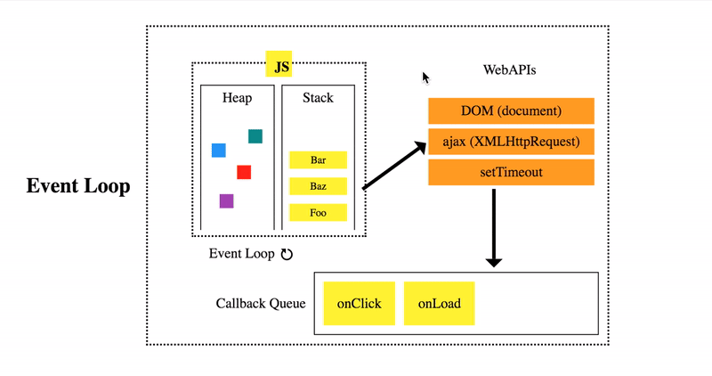

```toc
exclude: Table of Contents
from-heading: 1
to-heading: 5
```

# 1. 넓은 범위에서의 작동원리

자바스크립트는 한줄한줄 코드를 읽어내려가는 `인터프리팅` 방식으로 언어를 해독한다.

[브라우저작동원리>자바스크립트엔진](http://localhost:8000/environment/environment1_%EC%9B%B9%EB%B8%8C%EB%9D%BC%EC%9A%B0%EC%A0%80%EC%9E%91%EB%8F%99%EC%9B%90%EB%A6%AC/#2-2-%EC%9E%90%EB%B0%94%EC%8A%A4%ED%81%AC%EB%A6%BD%ED%8A%B8%EC%97%94%EC%A7%84)

## 1.1 싱글스레드, 비동기 방식

자바스크립트는 자바스크립트엔진을 통해 `싱글스레드`와 `비동기 방식`으로 해독된다.

- `싱글스레드` : 자바스크립트는 프로세스 내에서 하나의 스레드를 통해 작업을 수행한다.

- `비동기 방식` : 비동기(Asynchronous)는 작업이 동시에 일어나는 것이 아니라 각자 별개로 일어남을 의미한다.

> 동기, 비동기의 개념이 많이 헷갈렸는데 동기[同期]는 같을 동자를 써서, 작업의 흐름이 모두 같은 맥락에서 일어나고, 비동기[非同期]는 그와반대로 작업이 작업의흐름과 상관없이 개별적으로 일어난다고 이해하였다!

> 비동기 방식을 `Non-Blocking processing model`(막힘이 발생하지 않음) 라고도 한다. 즉, A, B, C 작업의 흐름에서 B에서 blocking이 일어나도 C를 수행한다.

그럼 blocking은 언제 발생할까?

blocking은 요청을 보내서 **시간이 걸리는 작업들**에서 발생한다.

> ex) 서버에서 데이터를 요청하고 받아오는 경우(AJAX), DOM 조작, setTimeout() 같은 내장 함수

- `AJAX`(Asynchronous Javascript And Xml) : JavaScript를 사용한 비동기 통신, 클라이언트와 서버간에 XML 데이터를 주고받는 기술

그럼 자바스크립트는 blocking을 어떻게 막힘이 없는 비동기 방식으로 처리할까?

## 1.2 자바스크립트 이벤트루프



- `heap` : 자바스크립트 내의 객체, 전역 변수 등 메모리할당하는 역할

- `stack`: 자바스크립트 내의 지역 변수, 콜 함수 등 메모리할당하는 역할

이벤트루프 매커니즘

1. 자바스크립트의 함수들이 실행되면 함수들은 stack에 push(저장)되고 실행이 완료되면 pop(제거)된다.

> ㄴ 싱글스레드 개념

2. blocking (시간이 걸리는 작업들)이 들어오면 콜백함수와 함께 pop(제거)되며 web API 로 보내진다. 이 때, 다음 stack의 함수들을 실행한다.

> ㄴ 비동기 방식

3. web API 의 콜백 응답결과를 callback Queue에 저장하고, stack 에 남은 함수들이 없으면 콜백함수는 다시 stack에 push 되서 실행된다.

> ㄴ 이벤트루프

이렇게 callback Queue에 작업이 들어있는지, stack이 비어있는지 끊임없이 감시하고 작업을 실행하는 것을 `이벤트 루프`가 담당한다.

> web API 와 콜백 큐, 이벤트루프 덕분에 자바스크립트는 비동기 방식으로 작동할 수 있다.

# 2. 좁은 범위에서의 작동원리

## 2-1. 실행 컨텍스트

..(작성중)
