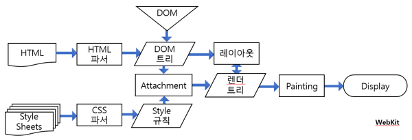

```toc
exclude: Table of Contents
from-heading: 1
to-heading: 5
```

# 1. Next.js

## 1-1. Next란

간단한 라우팅시스템과 서버사이드 렌더링을 지원하는 `리액트 프레임워크`

## 1-2. Next 사용하기

```
npm i next
```

```json
"scripts": {
  "dev": "next",
  "build": "next build",
  "start": "next start"
}
```

scripts 에 next 명령어를 등록하면 npm 명령어로 next 명령어를 실행할 수 있다.

# 2. Routing system

next 프레임워크의 Routing system은 프로젝트 root 디렉토리 안의 pages 디렉토리에서 이루어진다.

## 2-1. index.js

next 프레임워크의 주소 체계에서

`'/'` 즉, 해당 프로그램의 homepage는 기본적으로 `index.js`를 실행한다.

그리고 pages 안에 디렉토리를 넣거나 js 파일 (정확히는 **리액트 컴포넌트**)을 넣으면 next 프레임워크에서 이를 반영해 자동으로 routing system을 구축해준다.

> pages/about.js => localhost:3000/about

> pages/user/me.jsx => localhost:3000/user/me

```jsx
const Index = () => <div>Hello!</div>
```

## 2-2. next/link

next 프레임워크에서 컴포넌트 내부 라우팅(`Link` 태그)을 지원한다.

```jsx
import Link from 'next/link'

const Main = () => (
  <Link href="/about">
    <a>어바웃페이지</a>
  </Link>
)
```

## 2-3. next/head

next 프레임워크에서 html head태그의 요소(link, meta, script 등등)도 컴포넌트 형태로 쉽게 쓸 수 있게 지원한다.

```jsx
import Head from 'next/head'

const Main = () => (
  <Head>
    <title>My page title</title>
    <meta name="viewport" content="initial-scale=1.0, width=device-width" />
  </Head>
)
```

## 2-4. \_app.js

> Next.js uses the App component to initialize pages. You can override it and control the page initialization

프로그램의 `레이아웃` 역할을 하는 컴포넌트로 공통적으로 사용되는 요소들을 묶어서 최적화시키는 데 사용된다. `코드 스플리팅!`

직접 pages 디렉토리에 \_app.js 파일을 만들어 App 컴포넌트를 커스터마이징 할 수 있다.

```jsx
import React from 'react'
import { Container } from 'next/app'
import { GlobalStyle } from '../reset.css.ts'

const App = ({ Component }) => {
  return (
    <>
      {/* 이렇게 공통적으로 사용하는 styled-component 들을 가져오는 등 */}
      <GlobalStyle />
      <Container>
        {/* 여기 Component 컴포넌트(?)가 page들 역할을 한다 */}
        <Component />
      </Container>
    </>
  )
}
```

## 2-5. \_document.js

> A custom Document is commonly used to augment your application's <html> and <body> tags. This is necessary because Next.js pages skip the definition of the surrounding document's markup.

Document는 App보다 상위 개념으로 html, body, head 등 공통적으로 쓰이는 html요소들을 읽어오는데 사용된다.

\_app.js 와 마찬가지로 pages 디렉토리에 \_document.js 파일을 만들면 Document 컴포넌트를 커스터마이징 할 수 있다.

```jsx
import Document, { Html, Head, Main, NextScript } from 'next/document'

// :star: 클래스형 컴포넌트를 사용!
class MyDocument extends Document {
  // :star: getInitialProps로 SSR도 가능 (밑에서 계속)
  static async getInitialProps(ctx) {
    const initialProps = await Document.getInitialProps(ctx)
    return { ...initialProps }
  }

  render() {
    return (
      <Html>
        <Head />
        <body>
          <Main />
          <NextScript />
        </body>
      </Html>
    )
  }
}

export default MyDocument
```

## 2-6. \_error.js

Error컴포넌트(에러메시지표시)도 커스터마이징해서 쓸 수 있다. (client-side , server-side 둘다 가능)

```jsx
function Error({ statusCode }) {
  return (
    <p>
      {statusCode
        ? `An error ${statusCode} occurred on server`
        : 'An error occurred on client'}
    </p>
  )
}

Error.getInitialProps = ({ res, err }) => {
  const statusCode = res ? res.statusCode : err ? err.statusCode : 404
  return { statusCode }
}

export default Error
```

# 3. SSR (server-side rendering)

## 3-1. 렌더링??

`렌더링`은 렌더링엔진을 통해 html을 DOM Tree로 구성하고 요소들을 화면에 그려주는 행위를 의미한다.



> :bulb: :bulb: :bulb: **렌더링엔진**이랑 **자바스크립트엔진**이 하는일은 **다르다!!** 화면을 그려준다 와 자바스크립트를 해독하고 작업을 수행한다는 개념 잘 생각해보기!!

## 3-2. SPA

지난 리액트 포스트에서 SPA를 알아봤다.

[9) 자바스크립트 X 리액트](https://taeny.dev/javascript/9%EC%9E%90%EB%B0%94%EC%8A%A4%ED%81%AC%EB%A6%BD%ED%8A%B8x%EB%A6%AC%EC%95%A1%ED%8A%B8/)

`SPA (Single Page Application)`

서버로부터 완전한 새로운 페이지를 불러오지 않고 현재의 페이지를 동적으로 다시 작성함으로써 사용자와 소통하는 웹 애플리케이션이나 웹사이트를 말한다.

> 사용자와 서비스 사이의 인터렉션(`슈퍼매직`)이 많은 어플리케이션에서 DOM 렌더링을 서버사이드에서 하면 비효율적이다. (요청,,요청,,응답,,응답)

초기에 필요한 리소스들을 모두 요청해 DOM변화에 따른 렌더링을 클라이언트측에서 하는 방식의 어플리케이션을 **SPA**라 한다.

## 3-3. 클라이언트사이드 렌더링

`클라이언트사이드 렌더링`

클라이언트사이드 렌더링은 **DOM의 변화에 따른 렌더링을 서버로 요청을 보내지 않고 현재 클라이언트 환경에서 렌더링**하는 것을 말한다.

`특징`

- DOM 렌더링을 클라이언트에서 실행 (Browser)

- 서버에서 json만 받아오고 클라이언트 측에서 화면을 구성하고 기능을 수행.

- 빠른 인터렉션 (서버에 요청하고 렌더링하고 다시 응답하지 않기 때문)

- 트래픽 감소 (데이터가 몰리는 서버가 아닌 개인의 환경에서 일을 처리하기 때문)

`문제점`

- 초기구동속도가 느림 (페이지의 기능들을 초기에 모두 구축하기 때문)

- SEO 문제 (html이 아닌 자바스크립트를 읽지못하는 웹 크롤러들은 검색엔진 최적화가 잘 안됨)

`예시`

- 앵귤러의 MVC 패턴

- 리액트, 리덕스의 FLUX 패턴

## 3-4. 서버사이드 렌더링

서버사이드 렌더링은 **DOM의 변화에 따른 렌더링작업을 서버에 요청하고 서버에서 그 요청(렌더링)을 수행한 후 최종적인 파일을 응답해주는 매커니즘**을 말한다.

`특징`

- DOM 렌더링을 서버에서 실행 (Server)

- 서버 측에서 화면을 구성하고 기능을 수행하는 html을 작성해서 클라이언트에 뿌림. (Jsp, netxjs등)

- 초기구동속도가 빠름

- SEO 짱

`문제점`

- 데이터와 기능이 많을 때 불필요한 인터렉션(서버와의 요청,,응답,,) 가능성

- 트래픽 몰림 가능성

`예시`

- Java MVC 패턴 (:question: 더 알아보기)

- next JS SSR

# 4. next에서의 SSR (server-side rendering)

next 는 위에서 설명했듯, 리액트 프레임워크로 간단한 라우팅시스템과 서버사이드 렌더링을 지원한다.

:bulb: :bulb: :bulb: `리액트는 javascript로 화면(DOM tree)를 구성한다.` 그래서 html을 찍어보면 virtual Dom이 들어갈 태그와 화면을 구성할 태그만 존재할 뿐 비어있다.

하지만 next를 이용하면 SSR을 적용시킬 수 있다.

SSR 덕분에 `SEO 최적화`를 할 수 있고 `미리 필요한 데이터를 로드`할 수 있다.

## 4-1. next Life-cycle

## 4-2. getInitialProps

(작성중)
