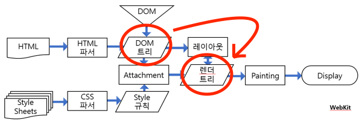

```toc
exclude: Table of Contents
from-heading: 1
to-heading: 5
```

# 0. 기존의 자바스크립트 문제점

앞선 포스트에서 javascript 로 브라우저의 window 객체, document 객체, 더 나아가 그 하위 element 등 (포괄해서 DOM) 에 접근하는 방법에 관해 알아봤다.

- [자바스크립트 X 브라우저 -1 (window)](https://taeny.dev/javascript/3%EC%9E%90%EB%B0%94%EC%8A%A4%ED%81%AC%EB%A6%BD%ED%8A%B8x%EB%B8%8C%EB%9D%BC%EC%9A%B0%EC%A0%801/)

- [자바스크립트 X 브라우저 -2 (document)](https://taeny.dev/javascript/4%EC%9E%90%EB%B0%94%EC%8A%A4%ED%81%AC%EB%A6%BD%ED%8A%B8x%EB%B8%8C%EB%9D%BC%EC%9A%B0%EC%A0%802/)

근데, 프로그램이 커질수록 DOM tree도 복잡해지고 여러 문제점들이 발생한다.

## 0-1. DOM 조작 코드 복잡해짐

```javascript
const state = '바뀐이름'
const name = document.getElementById('change_name')
const btn = document.getElementById('change_name_btn')

btn.onclick = function() {
  name.innerText = state
}
```

위의 코드는 간단하지만, 이러한 코드가 엄청 많아지고 DOM 조작에 필요한 상태(state)들도 많이 생기고, 심지어 DOM과 DOM끼리 상태를 주고받아야하는 상황이 온다면 코드를 관리하기가 무지무지 힘들어진다. (가능은 하겠지만)

> 기존의 DOM 조작을 간편하고 쉽게 해주는 `제이쿼리` 라이브러리를 사용하여도 한계가 있다.

> 새로운 리액트 문법(jsx)로 이어짐.(상태관리 쉽고 코드를 보기쉽고 관리하기 쉽게)

## 0-2. DOM 관리의 어려움

```html
<div>
  <div>
    <div>
      <!-- div 무한의계단-->
    </div>
  </div>
</div>
```

프로그램이 커지고 무수한 DOM element들이 생성되었을 때, DOM 조작은 둘째치고 각각의 element들이 어떤 기능을 하고있는지 파악하거나, 어디에 있는지 찾는 것이 정말 힘들어진다.

> 컴포넌트로 이어짐

## 0-3. 성능의 문제

위와 마찬가지 이유로 프로그램이 커지고 DOM 트리의 요소들이 많아졌을 때, DOM에 접근하고 조작하는 것에서 치명적인 비효율 문제가 발생한다.



위의 그림처럼 브라우저는 수많은 DOM 조작으로 바뀐 DOM tree를 Render tree로 바꾸는 작업을 바뀔 때마다 계속 수행해야 한다.

그럼 브라우저의 렌더링 엔진에 무리가 가거나 사용자에게 bad experience를 줄 수도 있다.

> virtual DOM 으로 이어짐

(작성중)
