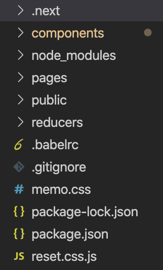
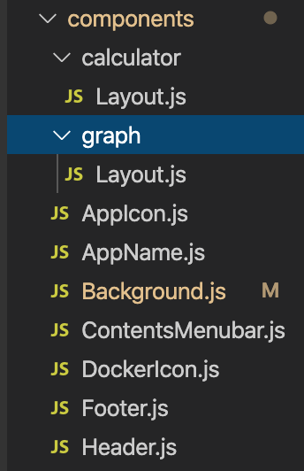
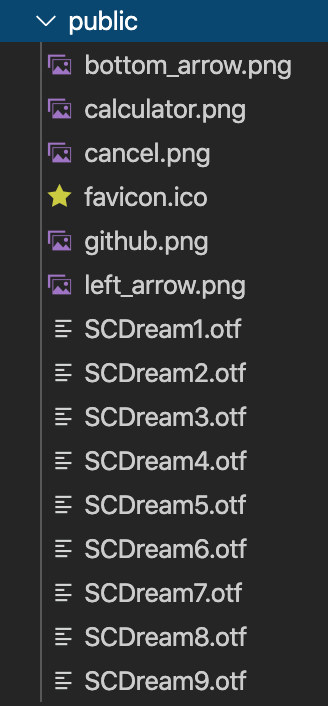
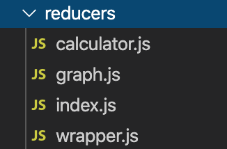

```toc
exclude: Table of Contents
from-heading: 1
to-heading: 6
```

# 0. Intro

- <a href="https://small-magic-project.now.sh/" target="_blank">프로젝트 사이트</a>

- <a href="https://github.com/taenykim/small-magic-project" target="_blank">프로젝트 깃허브소스</a>

기본기를 얼추(또 얼추야?) 공부하면서 여러가지 떠오르는 아이디어들을 메모장에 적어뒀다.

아이디어들은 실제 사용자들이 사용하면 어떨까하는 **복합적인 서비스**부터

**사소한 인터렉션 기능**까지 뭔가 만들 수 있는, 만들고 싶은 모든 것들을 차곡차곡 쌓아두었다.

근데 처음부터 거대한 시스템을 만드는 것보다는 사소한 기능들을 만들어보는 프로젝트를 하자는 생각을 했다.

> 1. 이번 프로젝트의 목적은 공부이다.

> 2. 개발은 협업하는 것이지만 개인프로젝트는 자신이 할 수 있고, 하고싶은 분야에 집중하는 것이 낫겠다라는 판단을 했다.

개발에 매력을 느끼게된 계기를 마법으로 표현했듯이 ([블로그를 시작하며](https://taeny.dev/essay/essay1_%EB%B8%94%EB%A1%9C%EA%B7%B8%EB%A5%BC%EC%8B%9C%EC%9E%91%ED%95%98%EB%A9%B0/))

프로젝트명을 `소마법 프로젝트`로 지었다. (a.k.a 토이프로젝트)

이번프로젝트는 기본적인 기능들과 로직, 혹은 디자인(ux,ui)에 포커스를 맞추고 앞으로 내가 구상한 것을 실제로 구현해보고자한다.

물론 공부의 목적이기 때문에 최대한 프로젝트를 하면서 느낀 것이나 배운 것들을 블로그에 기록할 것이다.

# 1.사용 라이브러리, 프레임워크

큰 틀은 `nextjs` 프레임워크를 통해 라우팅시스템을 사용하여 메인페이지에서 각각의 어플리케이션 페이지로 이동하도록 구상하였다.

그리고 각 페이지의 view는 `react` 라이브러리를 사용하기로 했다.

상태관리는 기본적으로 리액트 hooks를 통해서 하되, 각각의 어플리케이션을 여러개 켜두거나 잠시 background에 둘 때처럼 전체적인 상태관리는 `redux`를 사용하였다.

리덕스또한 hooks를 사용하려 했다.

그리고 디자인은 props전달이나 재사용성, 관리가 좋은 `styled-component`를 선택했다.

# 2. 레이아웃 구상


> 메인페이지

## 2-1. 디자인 컨셉1(뉴모피즘)

전체적인 디자인 컨셉은 `neumorphism`을 쓰기로 했다.

`flat` 한 디자인이나 색깔도 쨍한 느낌도 좋지만

최대한 모던하고 미니멀리즘틱한 느낌도 끌려서 선택했다.

> 뭔가 버튼을 누르고 싶게 하는 ux 적인 요소도 좋았던 것 같다.

> 사실 ux적으로 큰 고민을 하고 정하진 않았다. (그저 예쁜 것 같아서..)

## 2-2. 디자인 컨셉2(맥북)

이번 프로젝트 내에 여러 어플리케이션(기능들)을 넣는 것을 구상하였고

그리고 여러 어플리케이션을 동시에 쓸 수 있는 멀티태스킹도 구상해보았는데

그렇게 떠올린 디자인 컨셉이 `맥북 데스크탑` 형태였다.

메인페이지에 어플리케이션을 아이콘 형식으로 넣어두고 클릭하여 실행하며(라우팅),

어플리케이션을 종료하지 않고 다른 어플리케이션을 사용하다가 다시 돌아와도 데이터가 남아있는 것을 생각했다.(리덕스)

그렇게 하단에 Docker를 두었다.

## 2-3. 디테일

프로젝트 공유 레이아웃 (next의 App 컴포넌트!)를 통해

화면 상단 중앙에는 `full screen 모드 버튼`과 `제작노트링크 버튼`을 두었고

화면 상단 우측에는 깃허브 링크를 두었다.

# 3. 코드스플리팅, 디렉토리 구조

## 3-1. 전체적인 구조



## 3-2. pages


> next 프레임워크의 라우팅 시스템

## 3-3. components



> 컴포넌트들은 각 어플리케이션은 따로 폴더를 두었고, 전체적인 레이아웃 혹은 공통적으로 사용되는 부분은 루트 디렉토리에 두었다.

## 3-4. public



> 폰트, 이미지, 파비콘 등 프로젝트에 쓰일 static file들을 넣어주었다.

## 3-5. reducer



> 리듀서도 각 어플리케이션별로 코드 스플리팅 해주었다.

# 4. 라우팅 시스템

## 4-1. pages 디렉토리

next 프레임워크는 pages 디렉토리를 통해 라우팅시스템을 사용할 수 있다.

> :hatched_chick: \_error.js로 Error컴포넌트 커스터마이징하기

## 4-2. \_app.js

App 컴포넌트는 다음 방식으로 커스터마이징 해보았다.

```jsx
import React from 'react'
import { GlobalStyle } from '../reset.css.js'
import { Provider } from 'react-redux'
import withRedux from 'next-redux-wrapper'
import { applyMiddleware, compose, createStore } from 'redux'
import reducer from '../reducers'
import Background from '../components/Background.js'

const _app = ({ Component, store }) => {
  return (
    <>
      {/* :star: 글로벌스타일*/}
      <GlobalStyle />
      <Provider store={store}>
        {/* :star: 공통 레이아웃*/}
        <Background>
          <Component />
        </Background>
      </Provider>
    </>
  )
}

const configureStore = (initialState, options) => {
  const middlewares = []
  const enhancer =
    process.env.NODE_ENV === 'production'
      ? compose(applyMiddleware(...middlewares))
      : compose(
          applyMiddleware(...middlewares),
          !options.isServer &&
            typeof window.__REDUX_DEVTOOLS_EXTENSION__ !== 'undefined'
            ? window.__REDUX_DEVTOOLS_EXTENSION__()
            : f => f
        )
  const store = createStore(reducer, initialState, enhancer)
  return store
}

export default withRedux(configureStore)(_app)
```

## 4-3. :star: \<GlobalStyle \/\>

> styled component의 createGloadStyle을 이용해 전체적인 css부분을 reset.css.js 파일에 넣어주었다.

```js
// reset.css.js
import { createGlobalStyle } from 'styled-components'

export const GlobalStyle = createGlobalStyle`

// ...

`
```

> 모든 css 속성과 값을 reset해주고, 사용할 로컬 폰트 등을 넣어주었다.

## 4-4. :star: Background.js

> Component (next에서는 pages를 의미)들을 Background 컴포넌트로 감싸주었다. Background 컴포넌트는 모든 페이지에서 적용될 레이아웃 요소 (Header, Footer 등)들을 다시 넣어주었다.

```jsx
// Background.js
import React from 'react'
import styled from 'styled-components'
import Header from './Header'
import Footer from './Footer'

const BackgroundContainer = styled.div`
  display: flex;
  flex-direction: column;
  justify-content: center;
  align-items: center;
  width: 100vw;
  height: 100vh;
  background: #f5f6f7;
`

const FixedGithub = styled.div`
  position: fixed;
  z-index: 10;
  right: 0;
  top: 0;
  margin: 6px;

  & > img {
    filter: invert(48%) sepia(13%) saturate(3207%) hue-rotate(130deg) brightness(
        95%
      ) contrast(60%);
    cursor: pointer;
  }
`

const Background = ({ children }) => {
  return (
    <>
      <BackgroundContainer>
        <a href="https://github.com/taenykim/" target="_blank">
          <FixedGithub>
            
          </FixedGithub>
        </a>
        <Header></Header>
        {children}
        <Footer></Footer>
      </BackgroundContainer>
    </>
  )
}

export default Background
```

## 4-5. \_document.js

Document 컴포넌트는 다음 방식으로 커스터마이징 해보았다.

```jsx
import React from 'react'
import { ServerStyleSheet } from 'styled-components'
import Document, { Html, Head, Main, NextScript } from 'next/document'

class _document extends Document {
  static getInitialProps({ renderPage }) {
    const sheet = new ServerStyleSheet()
    const page = renderPage(App => props =>
      sheet.collectStyles(<App {...props} />)
    )
    const styleTags = sheet.getStyleElement()
    return { ...page, styleTags }
  }
  render() {
    return (
      <Html>
        <Head>{this.props.styleTags}</Head>
        <body style={{ fontFamily: 'escore3' }}>
          <Main />
          <NextScript />
        </body>
      </Html>
    )
  }
}

export default _document
```

> styled-components가 렌더링 되고 적용되는 문제를 해결하기 위해 `getInitialProps`를 통하여 스타일을 적용시킨 후 렌더링을 하도록 설정해주었다.

## 4-6. \_index.js

메인페이지

```jsx
import React from 'react'
import styled from 'styled-components'
import AppIcon from '../components/AppIcon'
import AppName from '../components/AppName'

const IndexContainer = styled.div`
  display: flex;
  width: 90vw;
  height: 90vh;
  margin: 10px 10px 10px 10px;
`

const AppContainer = styled.div`
  display: flex;
  flex-direction: column;
  align-items: center;
  margin: 5px 20px 10px 20px;
`

const index = () => {
  return (
    <>
      <IndexContainer>
        <AppContainer>
          <AppIcon name="calculator" />
          <AppName name="calculator" />
        </AppContainer>
        <AppContainer>
          <AppIcon name="graph" />
          <AppName name="graph" />
        </AppContainer>
      </IndexContainer>
    </>
  )
}

export default index
```

> 메인페이지는 AppIcon과 AppName 컴포넌트를 import해서 구성하였다. 그리고 각각의 props로 해당 어플리케이션 이름을 넘겨줘서 각각의 컴포넌트에서 직접 값이 바뀌게끔 `코드 재사용성`에 초점을 맞춰보았다.

## 4-7. application.js

```jsx
// calculator page
import React from 'react'
import Layout from '../components/calculator/Layout'

const calculator = () => {
  return (
    <>
      <Layout />
    </>
  )
}

export default calculator
```

```jsx
// graph page
import React from 'react'
import Layout from '../components/graph/Layout'

const graph = () => {
  return (
    <>
      <Layout />
    </>
  )
}

export default graph
```

> 각각의 페이지에 직접 기능들을 넣는 것보다 해당 기능들이 담긴 components 를 한번에 불러오는 것이 관리가 쉬울 것 같아 components 디렉토리 내의 해당 application 이름의 디렉토리를 만들고 layout 컴포넌트를 두었고 그것을 불러오는 방식으로 구성하였다.

# 5. 컴포넌트

## 5-1. Header (FullScreen Mode)

in Background Component

```jsx
import React, { useEffect, useState } from 'react'
import styled from 'styled-components'

const HeaderContainer = styled.div`
  display: flex;
  position: fixed;
  top: 0;
  margin-top: 10px;
  z-index: 5;
  font-size: 12px;
  font-family: escore6;
  color: #666;
`

const FullscreenText = styled.p`
  cursor: pointer;
`

const NoteText = styled.p`
  cursor: pointer;
`

const Header = () => {
  const [full, setFull] = useState(false)

  useEffect(() => {
    document.addEventListener('fullscreenchange', () => {
      setFull(!full)
    })
  })

  const openFullScreen = () => {
    if (!document.fullscreenElement) {
      document.documentElement.requestFullscreen()
    } else {
      document.exitFullscreen()
    }
  }

  return (
    <HeaderContainer>
      <FullscreenText onClick={openFullScreen}>
        {full ? 'exit full screen' : 'full screen'}
      </FullscreenText>
      &nbsp;&nbsp;|&nbsp;&nbsp;<NoteText>note</NoteText>
    </HeaderContainer>
  )
}

export default Header
```

1. position : fixed로 위치고정.

2. 초기 `full` state 값을 **false**로 두고(hooks) `document` 객체에 **fullscreenchange** 이벤트 핸들러를 넣어주었고 이벤트 발생시 full state값을 **toggle** 하도록 하였다.

3. 그리고 `p태그`에 **click** 이벤트핸들러를 넣어주었고 이벤트가 발생하면 현재 스크린모드를 인식해서 스크린모드를 **toggle**하도록 하였다.

4. 마지막으로 **삼항연산자**를 통해 현재 스크린모드가 `p태그`에 적히도록 하였다.

## 5-2. Footer (Docker)

in Background Component

```jsx
import React from 'react'
import styled from 'styled-components'
import { useSelector } from 'react-redux'
import DockerIcon from './DockerIcon'

const FooterContainer = styled.div`
  display: flex;
  align-items: center;
  position: fixed;
  bottom: 0;
  width: 100%;
  height: 60px;
  background: rgba(0, 0, 0, 0.85);
  border-radius: 8px 8px 0px 0px;
`

const Docker = styled.div`
  display: flex;
  align-items: center;
  padding: 0px 20px 0px 20px;
`

const Footer = () => {
  const { docker } = useSelector(state => state.wrapper)
  return (
    <FooterContainer>
      <Docker>
        {docker.map((item, i) => {
          // :star:
          return <DockerIcon key={i} item={item} />
        })}
      </Docker>
    </FooterContainer>
  )
}

export default Footer
```

1. MacBook 하단의 그 Docker가 맞다...

2. `useSelector` 를 통해 **docker array**를 가져온다.

3. 그리고 현재 **docker array** 안에 있는 요소들을 map함수를 통해 `DockerIcon` 컴포넌트에 요소의 값을 props로 전달하고 뷰를 구성하도록 했다.

4. docker의 요소 값은 어플리케이션 이름이 **string** 형태로 저장되어있다.

```json
{
  "docker": ["calculator"]
}
```

## 5-3. :star: DockerIcon

in Footer Component

```jsx
import React from 'react'
import styled from 'styled-components'
import Link from 'next/link'

const AppIconContainer = styled.div`
  display: flex;
  justify-content: center;
  align-items: center;
  width: 40px;
  height: 40px;
  box-sizing: border-box;
  border-radius: 15%;
  background: #f5f6f7;
  color: ${props => {
    if (props.name === 'calculator') return 'red'
    else if (props.name === 'graph') return 'blue'
    else return 'black'
  }};
  margin-right: 10px;

  & > div {
    font-family: escore9;
    font-size: 20px;
    text-shadow: 3px 3px #ccc;
  }
`

const DockerIcon = ({ item }) => {
  const url = `/${item}`
  return (
    <Link href={url}>
      <a style={{ textDecoration: 'none' }}>
        <AppIconContainer name={item}>
          <div>{item[0].toUpperCase()}</div>
        </AppIconContainer>
      </a>
    </Link>
  )
}

export default DockerIcon
```

1. DockerIcon은 현재 docker array 안의 string을 props로 받는다.

2. 그 props string은 해당 어플리케이션의 이름이며 url로도 사용한다.

3. :apple: 그리고 styled components 의 props로도 넘겨줘서 해당 어플리케이션 이름에 따라 아이콘 색상을 변경하게끔 해주었다.

# 6. 리덕스(상태관리)

## 6-1. ContentsMenubar 컴포넌트

in Application > layout Component


> 이 부분..!

```jsx
import React from 'react'
import styled from 'styled-components'
import Link from 'next/link'
import { useDispatch } from 'react-redux'
import {
  STORE_CALCULATOR_DATA,
  STORE_RESET_CALCULATOR,
} from '../reducers/calculator'
import { STORE_GRAPH_DATA, STORE_RESET_GRAPH } from '../reducers/graph'
import { DOCKER_STORE, DOCKER_DELETE } from '../reducers/wrapper'

const ContentsMenubarContainer = styled.div`
  display: flex;
  align-items: center;
  width: 100%;
  height: 60px;
  top: 0;
  & img {
    width: 17px;
    height: 17px;
  }
`

const ImageContainer = styled.div`
  display: flex;
  justify-content: center;
  align-items: center;
  height: 30px;
  width: 30px;
  box-shadow: -4px -2px 4px 0px #ffffff, 4px 2px 6px 0px #ddd;
  border-radius: 2px;
  padding: 2px;
  &:hover {
    cursor: pointer;
  }
  &:active {
    box-shadow: 2px 2px 2px 0px #dfe4ea inset, -2px -2px 2px 0px white inset;
  }
  & > img {
    filter: invert(48%) sepia(13%) saturate(3207%) hue-rotate(130deg) brightness(
        95%
      ) contrast(80%);
  }
`

// :star: props ?!
const ContentsMenubar = ({ data, name }) => {
  const dispatch = useDispatch()

  // :star: redux action dispatch ?!
  const storeHandler = () => {
    switch (name) {
      case 'calculator': {
        dispatch({
          type: STORE_CALCULATOR_DATA,
          data: data,
        })
        dispatch({
          type: DOCKER_STORE,
          data: name,
        })
        return
      }
      case 'graph': {
        dispatch({
          type: STORE_GRAPH_DATA,
          data: data,
        })
        dispatch({
          type: DOCKER_STORE,
          data: name,
        })
        return
      }
      default: {
        dispatch({
          type: DOCKER_STORE,
          data: name,
        })
        return
      }
    }
  }

  const storeReset = () => {
    switch (name) {
      case 'calculator': {
        dispatch({
          type: STORE_RESET_CALCULATOR,
        })
        dispatch({
          type: DOCKER_DELETE,
          data: name,
        })
        return
      }
      case 'graph': {
        dispatch({
          type: STORE_RESET_GRAPH,
        })
        dispatch({
          type: DOCKER_DELETE,
          data: name,
        })
        return
      }
      default: {
        dispatch({
          type: DOCKER_DELETE,
          data: name,
        })
        return
      }
    }
  }

  return (
    <ContentsMenubarContainer>
      <Link href="/">
        <a style={{ margin: '2px 2px 2px 10px' }}>
          <ImageContainer onClick={storeReset}>
            </img>
          </ImageContainer>
        </a>
      </Link>
      <Link href="/">
        <a style={{ margin: '2px 2px 2px 10px' }}>
          <ImageContainer onClick={storeHandler}>
            </img>
          </ImageContainer>
        </a>
      </Link>
    </ContentsMenubarContainer>
  )
}

export default ContentsMenubar
```

## 6-2. :star: ContentsMenubar 컴포넌트의 props

```jsx
// calculator > layout.js
<ContentsMenubar
  data={{ result, tempResult, pressedOperator, isFirstNumberTyping }}
  name="calculator"
></ContentsMenubar>
```

`data props`

> 리덕스 스토어에 저장하고픈 데이터들을 객체형태로 넘겨줌

`name props`

> 현재 어플리케이션의 이름

## 6-3. wrapper 리듀서 (Docker)

```jsx
export const initialState = {
  docker: [],
}

export const DOCKER_STORE = 'DOCKER_STORE'
export const DOCKER_DELETE = 'DOCKER_DELETE'

export default (state = initialState, action) => {
  switch (action.type) {
    case DOCKER_STORE: {
      // docker에 해당 어플리케이션이 있으면 return
      if (state.docker.indexOf(action.data) >= 0)
        return {
          ...state,
        }
      //docker에 해당 어플리케이션이 없으면 push
      return {
        ...state,
        docker: [...state.docker, action.data],
      }
    }
    // filter를 통해 해당 어플리케이션 delete
    case DOCKER_DELETE:
      return {
        ...state,
        docker: state.docker.filter((v, i) => action.data !== v),
      }
    default: {
      return {
        ...state,
      }
    }
  }
}
```

## 6-4. application 리듀서 (calculator)

```js
export const initialState = {
  result: '0',
  tempResult: '',
  pressedOperator: '',
  isFirstNumberTyping: true,
}

export const STORE_CALCULATOR_DATA = 'STORE_CALCULATOR_DATA'
export const STORE_RESET_CALCULATOR = 'STORE_RESET_CALCULATOR'

export default (state = initialState, action) => {
  switch (action.type) {
    // contentsMenubar 에서 저장을 했으면 데이터 저장
    case STORE_CALCULATOR_DATA: {
      return {
        result: action.data.result,
        tempResult: action.data.tempResult,
        pressedOperator: action.data.pressedOperator,
        isFirstNumberTyping: action.data.isFirstNumberTyping,
      }
    }
    // contentsMenubar에서 닫기를 했으면 초기데이터로 초기화
    case STORE_RESET_CALCULATOR: {
      return {
        result: '0',
        tempResult: '',
        pressedOperator: '',
        isFirstNumberTyping: false,
      }
    }

    default: {
      return {
        ...state,
      }
    }
  }
}
```

# 7. 개인적인 피드백

## 7-1. SSR

서버사이드렌더링이 아직 안되었다.
