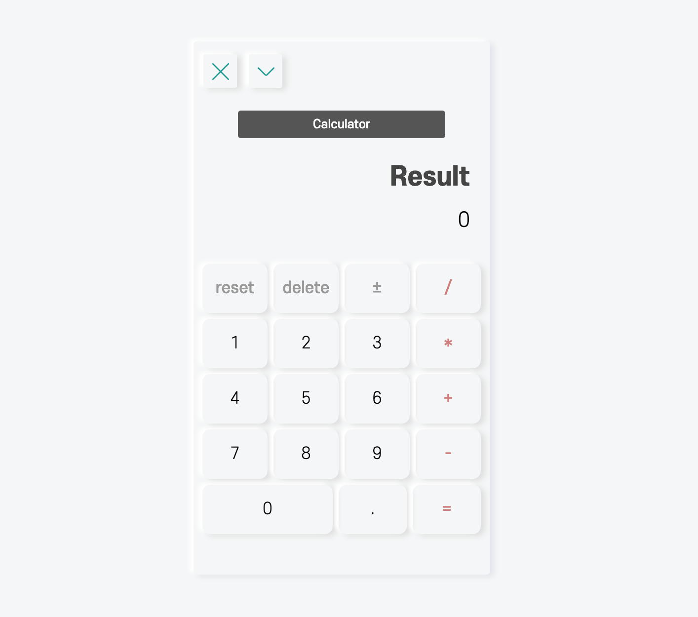

맨처음 어플리케이션으로 TodoList 보다 더 기본에 집중할 수 있는 계산기를 택했다.

> 모든 연산은 덧셈 뺄셈으로 이뤄진다..!

<hr/>

```toc
exclude: Table of Contents
from-heading: 1
to-heading: 6
```

# \#. Project Map

- :apple: <a href="https://small-magic-project.now.sh/" target="_blank">프로젝트 사이트</a>

- :apple: <a href="https://small-magic-project.now.sh/calculator" target="_blank">프로젝트 사이트/calculator</a>

* <a href="https://github.com/taenykim/small-magic-project" target="_blank">프로젝트 깃허브소스</a>

<br/>

> 제작노트

- [소마법 프로젝트 - 1 (container)](https://taeny.dev/project/%EC%86%8C%EB%A7%88%EB%B2%95-%ED%94%84%EB%A1%9C%EC%A0%9D%ED%8A%B81/)

- [소마법 프로젝트 - 2 (calculator)](https://taeny.dev/project/%EC%86%8C%EB%A7%88%EB%B2%95-%ED%94%84%EB%A1%9C%EC%A0%9D%ED%8A%B82/)

- [소마법 프로젝트 - 3 (graph)](https://taeny.dev/project/%EC%86%8C%EB%A7%88%EB%B2%95-%ED%94%84%EB%A1%9C%EC%A0%9D%ED%8A%B83/)

- [소마법 프로젝트 - 4 (crawling)](https://taeny.dev/project/%EC%86%8C%EB%A7%88%EB%B2%95-%ED%94%84%EB%A1%9C%EC%A0%9D%ED%8A%B84/)

- [소마법 프로젝트 - 5 (today)](https://taeny.dev/project/%EC%86%8C%EB%A7%88%EB%B2%95-%ED%94%84%EB%A1%9C%EC%A0%9D%ED%8A%B85/)

- [소마법 프로젝트 - 6 (jjal)](https://taeny.dev/project/%EC%86%8C%EB%A7%88%EB%B2%95-%ED%94%84%EB%A1%9C%EC%A0%9D%ED%8A%B86/)

- [소마법 프로젝트 - 7 (avengers)](https://taeny.dev/project/%EC%86%8C%EB%A7%88%EB%B2%95-%ED%94%84%EB%A1%9C%EC%A0%9D%ED%8A%B87/)

- [소마법 프로젝트 - 8 (maskmap)](https://taeny.dev/project/%EC%86%8C%EB%A7%88%EB%B2%95-%ED%94%84%EB%A1%9C%EC%A0%9D%ED%8A%B88/)

# 1. 레이아웃



## 1-1. 레이아웃1 (flex)

전체 container는 pixel로 고정적인 크기를 잡아주었고

요소 배치 레이아웃은 flex box로 잡아보았다.

> 빠..끄!

:hatched_chick: 레이아웃은 내가 원하는대로 잡혔는데 밑에 0, ., = 버튼이 살짝 맞지 않았다.

flex container의 자식 속성으로 상대적인 크기를 맞추기 위해 나머지 버튼들을 `flex : 1`로 주고 0버튼만 `flex : 2`로 주었는데 요소들의 상대적 크기에 margin값도 포함하면서 딱맞는 레이아웃이 나오지 않은 것 같다. 근데 디자인자체로 그렇게 나쁘지 않다는 합리화로 그냥 두었다.

> 벽돌식.. 레이아웃.. masonry 디자인이에요..

## 1-2. 레이아웃2 (값에 대한 뷰 2개!)


일반적인 계산기는 result 값과 현재 입력값을 보여주는 display가 1개존재한다.

즉, 현재입력값을 보여줄 때는 현재 저장되어있는 result값을 볼 수 없다는 `불편한 점`이 있었다.

그래서 값에 대한 display 뷰를

> 1. **저장된** result값 + 입력한 operator 를 보여주는 뷰

> 2. 현재 입력값 혹은 최종 결과값을 보여주는 뷰

두개를 만들었다.

## 1-3. :star: title View (display1)

> Title은 styled-component이다.

```jsx
<Title>
  {tempResult + (pressedOperator === 'equal' ? '' : pressedOperator) ||
    'Calculator'}
</Title>
```

tempResult는 저장된 값이고, 초기 tempResult 값은 ''로, 저장된 값이 없을 경우 'Calculator'가 찍히도록 하였다.

## 1-4. :star: result View (display2)

> ResultContainer, ResultText, ResultNumber는 styled-component이다.

```jsx
<ResultContainer>
  <ResultText>Result</ResultText>
  <ResultNumber>{result}</ResultNumber>
</ResultContainer>
```

그리고 전체 결과값 혹은 현재 입력값 result의 뷰도 구성해주었다.

# 2. 상태관리

```jsx
const data = useSelector(state => state.calculator)
const [result, setResult] = useState(data.result || '0')
const [tempResult, setTempResult] = useState(data.tempResult || '')
const [pressedOperator, setPressedOperator] = useState(
  data.pressedOperator || ''
)
const [isFirstNumberTyping, setIsFirstNumberTyping] = useState(
  data.isFirstNumberTyping || false
)
```

## 2-1. 리액트 hooks

컴포넌트를 class 가 아닌 `함수형`으로 구성하고 `클로저, hooks`를 이용해서 컴포넌트 내에서의 상태관리를 하였다.

상태변수는

> 1. `result` : 현재 입력값 || 최종 결과 값

> 2. `tempResult` : 저장된 결과값

> 3. `pressedOperator` : 저장된 operator

> 4. `isFirstNumberTyping` : operand를 처음치는지 확인하는 변수

## 2-2. :star: isFirstNumberTyping 변수

계산기에서 number를 입력하면 string을 더하듯이 나와야한다.

> 1 + 1 => 11

하지만 처음 초기값은 0인데 위처럼 입력하면

> 0 + 1 => not 1 but 01

이 화면에 출력된다.

이 현상을 막기 위해서 isFirstNumberTyping 변수를 두고 처음 입력시에는 처음 입력한 number가 결과값에 들어가도록 설정해주었다.

> 물론 첫 타이핑 number가 0일 경우의 조건체크도 해줬다.

## 2-3. 리덕스 hooks

처음 컴포넌트를 구성할 때, calculator reducer의 초기값을 가져오도록 설정했다.

그리고 다른 어플리케이션을 쓰기 위해 이 계산기 어플리케이션을 잠시 Docker에 넣었을 때, 현재 리액트 state를 리덕스 state로 옮기도록 설정했다.

즉, 해당 어플리케이션의 state 조작은 리액트로,

해당 어플리케이션의 state 임시저장( Docker 넘기기 )은 리덕스로 하였다.

# 3. 이벤트처리

> CaculatorButtonRow는 styled-component이다.

```jsx
<CaculatorButtonRow>
  <button
    name="1"
    type="button"
    onClick={e => buttonClickHandler(e.target.name)}
  >
    1
  </button>
  <button
    name="2"
    type="button"
    onClick={e => buttonClickHandler(e.target.name)}
  >
    2
  </button>
  <button
    name="3"
    type="button"
    onClick={e => buttonClickHandler(e.target.name)}
  >
    3
  </button>
  <button
    className="rightButton"
    name="multiple"
    type="button"
    onClick={e => buttonClickHandler(e.target.name)}
  >
    *
  </button>
</CaculatorButtonRow>
```

## 3-1. click 이벤트 핸들러 (buttonClickHandler)

계산기 어플리케이션에 있는 모~든 버튼의 click 이벤트핸들러 함수는 `buttonClickHandler` 함수로 통일 시켜주었다.

버튼마다 name을 적어주고 e.target.name을 함수에 전달해줌으로서, 해당 함수에서 전달받은 값에 따라 로직을 처리하게끔 해주었다.

```js
const buttonClickHandler = button_type => {
  if (button_type === 'reset') {
    setResult('0')
    setTempResult('')
    setPressedOperator('')
  } else if (button_type === 'delete') {
    if (result === '0') return
    result.length === 1
      ? (setResult('0'), setIsFirstNumberTyping(true))
      : setResult(result.substr(0, result.length - 1))
  } else if (button_type === 'plus') {
    const block_result = operating(pressedOperator)
    setTempResult(block_result)
    setPressedOperator('plus')
    setIsFirstNumberTyping(true)

    if (pressedOperator !== '') {
      setResult(block_result)
    }
  } else if (button_type === 'minus') {
    const block_result = operating(pressedOperator)
    setTempResult(block_result)
    setPressedOperator('minus')
    setIsFirstNumberTyping(true)

    if (pressedOperator !== '') {
      setResult(block_result)
    }
  } else if (button_type === 'multiple') {
    const block_result = operating(pressedOperator)
    setTempResult(block_result)
    setPressedOperator('multiple')
    setIsFirstNumberTyping(true)

    if (pressedOperator !== '') {
      setResult(block_result)
    }
  } else if (button_type === 'divide') {
    const block_result = operating(pressedOperator)
    setTempResult(block_result)
    setPressedOperator('divide')
    setIsFirstNumberTyping(true)

    if (pressedOperator !== '') {
      setResult(block_result)
    }
  } else if (button_type === 'equal') {
    const block_result = operating(pressedOperator)
    setTempResult(block_result)
    setPressedOperator('equal')
    setIsFirstNumberTyping(true)
    if (pressedOperator !== '') {
      setResult(block_result)
    }
  } else if (button_type === 'period') {
    if (result.indexOf('.') < 0) {
      setResult(result + '.')
    }
    setIsFirstNumberTyping(false)
  } else if (button_type === 'toggleSign') {
    setResult(result[0] === '-' ? result.substr(1) : '-' + result)
  } else if (
    button_type === '1' ||
    '2' ||
    '3' ||
    '4' ||
    '5' ||
    '6' ||
    '7' ||
    '8' ||
    '9' ||
    '0'
  ) {
    if (isFirstNumberTyping) {
      setResult(button_type)
      setIsFirstNumberTyping(false)
    } else {
      result[0] === '0'
        ? setResult(button_type)
        : setResult(result + button_type)
    }
  }
}
```

## 3-2. :star: operating 함수

```jsx
const operating = operator_type => {
  if (operator_type === 'plus')
    return String(Number(tempResult) + Number(result))
  else if (operator_type === 'minus')
    return String(Number(tempResult) - Number(result))
  else if (operator_type === 'multiple')
    return String(
      tempResult === '' ? Number(result) : Number(tempResult) * Number(result)
    )
  else if (operator_type === 'divide')
    return String(
      tempResult === '' ? Number(result) : Number(tempResult) / Number(result)
    )
  else return String(Number(result))
}
```

계산기 프로그램은 number를 입력하고 operator를 입력하고 다음 number를 입력하는 식으로 값을 계산한다.

> 1 + 3 \* 2 식으로 누르면 7이 아니라, 8이 나옴.

즉, 1 + 3 까지 누르고 \*를 눌렀을 때, 프로그램은 \*를 수행하는 것이 아니라 +를 수행하고 \*를 저장하는 방식으로 계산해야한다.

그래서 e.target.name에 operator가 들어오면 저장된 operator를 통해서 operating 함수를 먼저 실행하게끔 하였다.

# 4. 개인적인 피드백

## 4-1. flex layout

위에서 언급했듯이, 0버튼이 버튼 두개의 크기만큼 들어맞지는 않는다.

## 4-2. , 콤마

숫자가 세자리수를 초과할 때마다 ,를 찍는 기능이 없다.

> ex) 1,000,000

계산기의 period(점), 부호 등은 모두 값의 length 변화를 준다. 하지만 ,(콤마)를 넣으려면 이런 length 변화에 따른 처리를 다시 해줘야하는데 하지 않았다.
