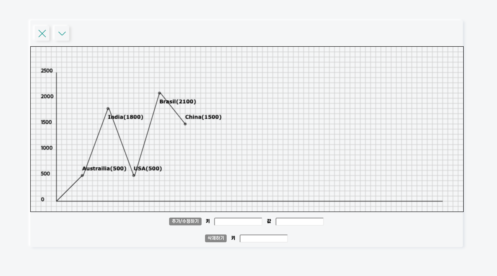

```toc
exclude: Table of Contents
from-heading: 1
to-heading: 6
```

# \#. Project Map

- :apple: <a href="https://small-magic-project.now.sh/" target="_blank">프로젝트 사이트</a>

- :apple: <a href="https://small-magic-project.now.sh/graph" target="_blank">프로젝트 사이트/graph</a>

* <a href="https://github.com/taenykim/small-magic-project" target="_blank">프로젝트 깃허브소스</a>

<br/>

> 제작노트

- [소마법 프로젝트 - 1 (container)](https://taeny.dev/project/%EC%86%8C%EB%A7%88%EB%B2%95-%ED%94%84%EB%A1%9C%EC%A0%9D%ED%8A%B81/)

- [소마법 프로젝트 - 2 (calculator)](https://taeny.dev/project/%EC%86%8C%EB%A7%88%EB%B2%95-%ED%94%84%EB%A1%9C%EC%A0%9D%ED%8A%B82/)

- [소마법 프로젝트 - 3 (graph)](https://taeny.dev/project/%EC%86%8C%EB%A7%88%EB%B2%95-%ED%94%84%EB%A1%9C%EC%A0%9D%ED%8A%B83/)

- [소마법 프로젝트 - 4 (crawling)](https://taeny.dev/project/%EC%86%8C%EB%A7%88%EB%B2%95-%ED%94%84%EB%A1%9C%EC%A0%9D%ED%8A%B84/)

- [소마법 프로젝트 - 5 (today)](https://taeny.dev/project/%EC%86%8C%EB%A7%88%EB%B2%95-%ED%94%84%EB%A1%9C%EC%A0%9D%ED%8A%B85/)

- [소마법 프로젝트 - 6 (jjal)](https://taeny.dev/project/%EC%86%8C%EB%A7%88%EB%B2%95-%ED%94%84%EB%A1%9C%EC%A0%9D%ED%8A%B86/)

- [소마법 프로젝트 - 7 (avengers)](https://taeny.dev/project/%EC%86%8C%EB%A7%88%EB%B2%95-%ED%94%84%EB%A1%9C%EC%A0%9D%ED%8A%B87/)

- [소마법 프로젝트 - 8 (maskmap)](https://taeny.dev/project/%EC%86%8C%EB%A7%88%EB%B2%95-%ED%94%84%EB%A1%9C%EC%A0%9D%ED%8A%B88/)

# 0. Intro

데이터들을 그래프로 표현해보고 싶어서 만들어보았다.

이상한 병이 있어서 라이브러리를 사용하지 않고 canvas를 이용해서 만들어보려고 했는데 만들고나서 견해가 바뀌었다..!

# 1. 레이아웃



그래프는 canvas를 이용해 그렸고

데이터를 추가, 수정, 삭제할 수 있는 form Input 요소들도 넣어주었다.

그리고 초기 데이터로 임의의 키들과 값들을 넣어주었다.

# 2. 상태관리

```js
const data = useSelector(state => state.graph)
const [graphData, setGraphData] = useState(
  data.graphData || {
    Austrailia: 500,
    India: 1800,
    USA: 500,
    Brasil: 2100,
    China: 1500,
  }
)
const entries = Object.entries(graphData)

const [country, setCountry] = useState(data.country || '')
const [population, setPopulation] = useState(data.population || '')
const [country2, setCountry2] = useState('')
const [errorMessage, setErrorMessage] = useState('')
const inputRef1 = useRef()
const inputRef2 = useRef()
```

## 2-1. 리액트 hooks

컴포넌트를 class 가 아닌 `함수형`으로 구성하고 `클로저, hooks`를 이용해서 컴포넌트 내에서의 상태관리를 하였다.

상태변수는

> 1. `graphData` : 그래프에 들어있는 객체 형태의 데이터

> 2. `country` : 추가, 수정을 위한 키값

> 3. `country2` : 삭제를 위한 키값

> 4. `population` : 추가, 수정을 위한 밸류값

> 5. `errorMessage` : 에러메시지를 담은 string 값

초기 데이터를 나라와 인구로 해서 country, population으로 key, value 값들을 변수 네이밍 해줬다.

그리고 object의 키값과 밸류값을 관리하기 위해 entries 변수를 만들어줬고

form submit 후의 자동 input focus를 위해 inputRef1, inputRef2 변수도 만들어주었다.

## 2-2. 리덕스 hooks

처음 컴포넌트를 구성할 때, graph reducer의 초기값을 가져오도록 설정했다.

그리고 다른 어플리케이션을 쓰기 위해 이 그래프 어플리케이션을 잠시 Docker에 넣었을 때, 현재 리액트 state를 리덕스 state로 옮기도록 설정했다.

즉, 해당 어플리케이션의 state 조작은 리액트로,

해당 어플리케이션의 state 임시저장( Docker 넘기기 )은 리덕스로 하였다.

# 3. Canvas

## 3-1. useEffect

```js
useEffect(() => {
  let canvasElem = document.querySelector('canvas')
  canvasElem.width = 840
  canvasElem.height = 320
  const ctx = canvasElem.getContext('2d')
  drawGrid(canvasElem, ctx)
  drawAxis(ctx)
  drawChart(ctx)
})
```

컴포넌트가 마운팅 된 후 useEffect hooks를 통하여 canvas를 그리도록 하였다.

## 3-2. drawGrid()

```js
const drawGrid = (canvasElem, ctx) => {
  let xGrid = 10
  let yGrid = 10
  let cellSize = 10
  ctx.beginPath()
  while (xGrid < canvasElem.height) {
    ctx.moveTo(0, xGrid)
    ctx.lineTo(canvasElem.width, xGrid)
    xGrid += cellSize
  }
  while (yGrid < canvasElem.width) {
    ctx.moveTo(yGrid, 0)
    ctx.lineTo(yGrid, canvasElem.height)
    yGrid += cellSize
  }
  ctx.strokeStyle = '#ccc'
  ctx.stroke()
}
```

전체 그리드를 그려주는 함수 작성

## 3-3. drawAxis()

```js
const drawAxis = ctx => {
  let yPlot = 300
  let pop = 0

  ctx.beginPath()
  ctx.strokeStyle = 'black'
  ctx.moveTo(50, 50)
  ctx.lineTo(50, 300)
  ctx.lineTo(800, 300)
  ctx.moveTo(50, 300)

  for (let i = 0; i < 10; i++) {
    ctx.strokeText(pop, 20, yPlot)
    pop += 500
    yPlot -= 50
  }
  ctx.stroke()
}
```

x축과 y축, x축의 값들을 그려주는 함수 작성

## 3-4. drawChart()

```js
const drawChart = ctx => {
  ctx.beginPath()
  ctx.strokeStyle = 'black'
  ctx.moveTo(50, 300)
  ctx.font = 'bold normal 10px Verdana'

  var xPlot = 100
  let i = 0

  for (const [country, population] of entries) {
    var populationInBlocks = population / 10
    ctx.fillText(
      country + '(' + population + ')',
      xPlot,
      i % 2 === 0
        ? 300 - populationInBlocks - 10
        : 300 - populationInBlocks - 10 + 30
    )
    ctx.lineTo(xPlot, 300 - populationInBlocks)
    ctx.arc(xPlot, 300 - populationInBlocks, 2, 0, Math.PI * 2, true)
    xPlot += 50
    i++
  }
  ctx.stroke()
}
```

그래프를 그리는 함수 작성

## 3-5. :star: 변수 i

그래프의 각각의 텍스트 값들이 동일한 위치에 위치할 경우 텍스트가 겹치는 현상이 있었다. 그래서 변수 i를 할당하고 짝수일 경우는 꼭지점 밑에 텍스트를 적고 홀수일 경우는 꼭지점 위에 텍스트를 적게해서 겹치는 현상을 피해주었다.

# 4. 이벤트 처리

## 4-1. submit 이벤트 핸들러

```js
const submitHandler1 = e => {
  console.log(graphData)
  e.preventDefault()

  if (
    isNaN(Number(population)) ||
    Number(population) > 2500 ||
    Number(population) < 0
  ) {
    setErrorMessage('0~2500사이의 값을 입력하세요.')
    return
  }
  let obj = { ...graphData }
  obj[country] = Number(population)
  // obj.county = population not same!!
  let graphData_temp = Object.assign({}, obj)
  setGraphData(graphData_temp)
  setCountry('')
  setPopulation('')
  setErrorMessage('')
  inputRef1.current.focus()
}
```

## 4-2. :star: isNaN, number condition

값 input의 값이 숫자가 아닐 경우, 그리고 입력값의 범위가 canvas 를 넘을 경우 핸들링하는 조건문을 넣어주었다.

그리고 조건문에 걸릴 경우, 에러메시지를 출력하게끔 해주었다.

## 4-3. :star: :star: obj

해당 키와 값이 정상적일 경우, state를 불변성을 유지하면서 업데이트해주려 했다.

새로운 obj 변수에 spread 문법(...)을 통해 기존 state를 초기화해주었고 obj에 새로운 키, 값을 넣어준 뒤 업데이트 해주었다.

여기서 새롭게 안 점은,

`obj.key = value`를 통한 obj 업데이트는 실제로 key값으로 key가 들어갔다.

이를 피하기 위해서 `obj[key] = value`를 이용해야 정상적으로 key의 string값이 key로 들어갔다.

> delete 의 경우도 마찬가지다. `delete obj[country2]`

# 5. 개인적인 피드백

## 5-1. canvas는 read only

사실 그래프 안에 있는 선이나 점에 이벤트를 추가하고싶었다.

근데 canvas는 함수를 통해 도형을 그릴 뿐 DOM처럼 직접 안의 도형에 이벤트를 추가할 수 없다.

실제 canvas에 이벤트를 걸려면 canvas 자체에 이벤트 핸들러를 달거나 해야한다.

아직 canvas를 자유자재로 사용할 수 없는 실력이기도 하고 canvas 내부의 도형에 이벤트를 넣지 못한게 좀 아쉽다.

## 5-2. 라이브러리

그래프에 이벤트를 넣는 가장 쉬운 방법은 라이브러리를 사용하는 것이다.

다음 프로젝트로 그래프, 차트 라이브러리를 사용해보고 싶다.

## 5-3. 디자인

디자인이 매우 구리다..!

## 5-4. 네이밍

변수를 country, population 처럼 어플리케이션의 목적성이 다소 맞지 않는 네이밍을 했다.

1. 초기 데이터를 나라와 인구로 해서

2. 사용자에게는 보이지 않고 개발자 입장에서 이해할 수 있으면 된다.

라는 합리화를 할 수 있겠지만,

country, country2 이런 변수 네이밍은 합리화 자체도 불가능하다.

> 개발자도 헷갈리기 때문..

해당 어플리케이션이 기능이 많은 편이 아니라서 네이밍을 수정하지는 않았지만, 처음 변수 네이밍을 지을 때 그래도 좀 더 신경쓰는 습관을 들여야겠다.
