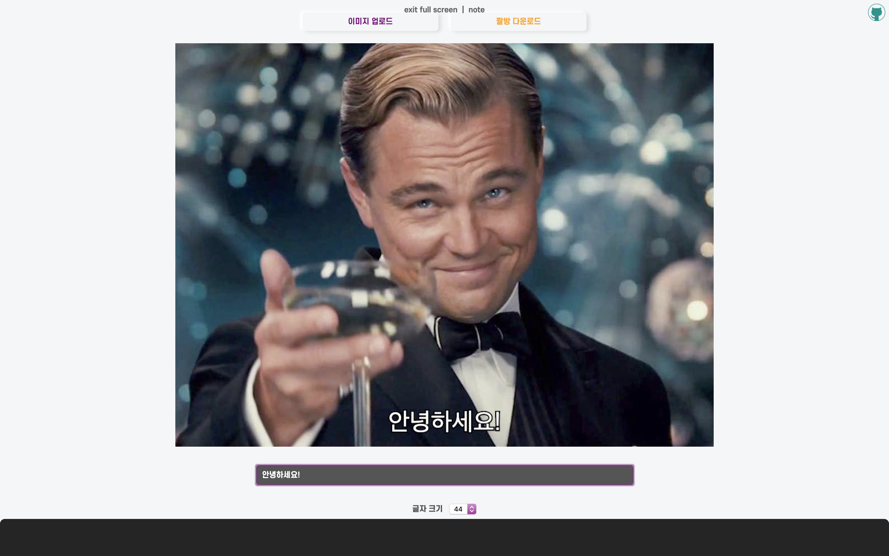
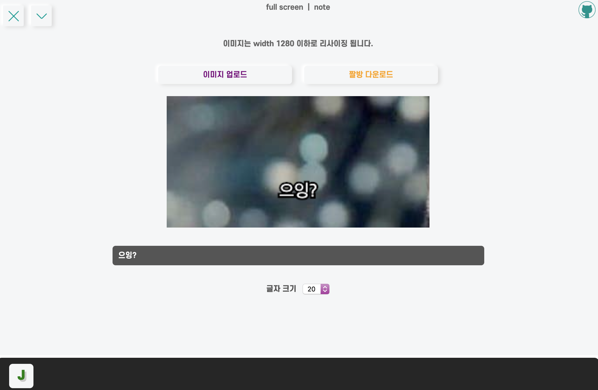

```toc
exclude: Table of Contents
from-heading: 1
to-heading: 5
```

# \#. Project Map

- <a href="https://small-magic-project.now.sh/" target="_blank">프로젝트 사이트</a>

- <a href="https://github.com/taenykim/small-magic-project" target="_blank">프로젝트 깃허브소스</a>

- [소마법 프로젝트 - 1 (container)](https://taeny.dev/project/%EC%86%8C%EB%A7%88%EB%B2%95-%ED%94%84%EB%A1%9C%EC%A0%9D%ED%8A%B81/)

- [소마법 프로젝트 - 2 (calculator)](https://taeny.dev/project/%EC%86%8C%EB%A7%88%EB%B2%95-%ED%94%84%EB%A1%9C%EC%A0%9D%ED%8A%B82/)

- [소마법 프로젝트 - 3 (graph)](https://taeny.dev/project/%EC%86%8C%EB%A7%88%EB%B2%95-%ED%94%84%EB%A1%9C%EC%A0%9D%ED%8A%B83/)

- [소마법 프로젝트 - 4 (crawling)](https://taeny.dev/project/%EC%86%8C%EB%A7%88%EB%B2%95-%ED%94%84%EB%A1%9C%EC%A0%9D%ED%8A%B84/)

- [소마법 프로젝트 - 5 (today)](https://taeny.dev/project/%EC%86%8C%EB%A7%88%EB%B2%95-%ED%94%84%EB%A1%9C%EC%A0%9D%ED%8A%B85/)

- [소마법 프로젝트 - 6 (jjal)](https://taeny.dev/project/%EC%86%8C%EB%A7%88%EB%B2%95-%ED%94%84%EB%A1%9C%EC%A0%9D%ED%8A%B86/)

# 0. Intro

이미지를 **업로드**하고 **수정**하고 **다운로드**하는 기능을 만들어보고 싶어서

`짤방생성기`를 한번 만들어보았다.

# 1. 레이아웃

## 1-1. 메인화면


> 1. 어플리케이션 설명

> 2. 이미지 업로드 버튼과 다운로드 버튼

> 3. 이미지 미리보기 창 (canvas 이용)

> 4. 이미지에 삽입할 텍스트 창 (input 이용)

> 5. 텍스트 크기 조절 셀렉트박스 (select 이용)

## 1-2. 이미지 업로드 화면



> 치명적..

## 1-3. 생성된 이미지


> "Hello world!"

# 2. 상태관리

```jsx
const data = useSelector(state => state.jjal)

const [text, setText] = useState(data.text || 'welcome to my page')
const [imageOn, setImageOn] = useState(data.imageOn || '')
const [imageOnWidth, setImageOnWidth] = useState(data.imageOnWidth || '')
const [imageOnHeight, setImageOnHeight] = useState(data.imageOnHeight || '')
const [downloadHref, setDownloadHref] = useState(data.downloadHref || '')
const [textFontSize, setTextFontSize] = useState('20')
```

## 2-1. 리액트 state

**리액트 hooks**를 이용해서 컴포넌트 내에서의 상태관리를 하였다.

상태변수는

> 1. `text` : 이미지에 삽입될 텍스트

> 2. `imageOn` : 업로드된 이미지

> 3. `imageOnWidth` : 업로드된 이미지 width

> 4. `imageOnHeight` : 업로드된 이미지 height

> 5. `downloadHref` : 다운로드링크

> 6. `textFontSize` : 이미지에 삽입될 텍스트 크기

## 2-2. 리덕스 store

**리덕스 hooks**를 이용했다.

contentsMenuBar에서 데이터를 저장하는 버튼을 누르면 `useDispatch`를 통해 데이터를 저장하고

`useSelector`로 저장된 데이터를 불러왔다.

# 3. 이미지 업로드

## 3-1. View

```jsx
<label htmlFor="imageLoader">이미지 업로드</label>
<input type="file" id="imageLoader" name="imageLoader" hidden onChange={handleImage} />
```

file 타입의 input 태그를 hidden 으로 가리고 label에 이미지 업로드라는 글자와 css를 넣어주었다.

## 3-2. :apple: FileReader()

```js
const handleImage = e => {
  var reader = new FileReader()
  reader.onload = event => {
    // :star: reader가 load되면 실행
  }
  reader.readAsDataURL(e.target.files[0])
}
```

파일을 읽을 때, `FileReader` 객체를 이용했다.

FileReader 객체의 `readAsDataURL()` 메소드를 이용해 파일을 읽은 후, 해당 파일의 데이터 URI를 result 속성에 저장하였다.

그리고 FileReader 객체는 이벤트핸들러를 등록할 수 있는데,

> event : load(읽기 완료), progress(읽는 중), error(에러)

`onload` 이벤트핸들러로 파일이 읽기 완료되면 다음 함수를 실행하도록 하였다.

> FileReader의 비동기 메커니즘을 볼 수 있었다.

## 3-3. :apple: Image()

```js
// 위의 주석부분

reader.onload = event => {
  var img = new Image()
  img.onload = () => {
    // :star: img가 load되면 실행
  }
  img.src = event.target.result
}
```

FileReader 로드가 완료된 후, 파일이 uri 형태로 들어있는 result 속성을 `Image` 객체 속성 src에 넣어주었다.

그리고 마찬가지로 `onload` 이벤트핸들러로 다음 함수를 실행하도록 하였다.

> 마찬가지로 비동기 매커니즘

## 3-4. 이미지 리사이징

```js
// 위의 주석부분

img.onload = () => {
  let max_size = 1280,
    width = img.width,
    height = img.height

  if (width > height) {
    if (width > max_size) {
      height *= max_size / width
      width = max_size
    }
  } else {
    if (height > max_size) {
      width *= max_size / height
      height = max_size
    }
  }
  canvas.width = width
  canvas.height = height
  ctx.drawImage(img, 0, 0, width, height)
  setImageOnWidth(width)
  setImageOnHeight(height)
}
```

이미지의 onload 이벤트핸들러에는 이미지 리사이징 함수와, canvas 에 해당 이미지를 그리고 해당 이미지를 저장하는 코드를 넣어주었다.

리사이징은 먼저 `max_size`를 두고, 해당 이미지의 width 혹은 height가 `max_size`를 초과하면 초과한 width, height를 `max_size`로 맞추고 나머지 width, height를 비율에 맞게 조정하는 식으로 하였다.

> width : height = x : max_size (height가 초과한경우)

# 4. 이미지에 텍스트 삽입

## 4-1. 텍스트 입력창

```jsx
<input
  type="file"
  id="imageLoader"
  name="imageLoader"
  hidden
  onChange={e => {
    // :star:
    setText(e.target.value)
  }}
/>
```

## 4-2. 텍스트 크기 변경창

```jsx
<div style={{ display: 'flex', alignItems: 'center' }}>
  <label
    style={{
      marginRight: '10px',
      fontFamily: 'escore7',
      fontSize: '12px',
      color: '#555',
    }}
    htmlFor="textFontSize"
  >
    글자 크기
  </label>

  <select
    id="textFontSize"
    onChange={e => {
      // :star:
      setTextFontSize(e.target.value)
    }}
  >
    <option value="20">20</option>
    <option value="28">28</option>
    <option value="36">36</option>
    <option value="44">44</option>
  </select>
</div>
```

텍스트 입력창, 텍스트 크기 변경창 모두 change 이벤트핸들러 콜백함수를 따로 선언하지 않고 속성값 내부에서 바로 실행하게끔 하였다.

# 5. real-time Canvas

## 5-1. :apple: useEffect

```jsx
useEffect(() => {
  var canvas = document.getElementById('imageCanvas')
  const ctx = canvas.getContext('2d')
  ctx.textAlign = 'center'
  ctx.textBaseline = 'middle'
  ctx.font = `${textFontSize}px Gulim`
  ctx.clearRect(0, 0, canvas.width, canvas.height)
  if (imageOn) {
    ctx.drawImage(imageOn, 0, 0, imageOnWidth, imageOnHeight)
  } else {
    ctx.fillStyle = 'dodgerblue'
    ctx.fillRect(0, 0, canvas.width, canvas.height)
  }
  ctx.lineWidth = 5
  ctx.strokeStyle = `black`
  ctx.strokeText(text, canvas.width / 2, canvas.height - 40)
  ctx.fillStyle = `white`
  ctx.fillText(text, canvas.width / 2, canvas.height - 40)
})
```

앞서 업로드한 이미지와 텍스트의 값과 스타일을 canvas에 그리는 역할로 `useEffect` 함수를 사용하였다.

## 5-2. :apple: real-time Canvas

처음 코드를 작성할 때, 텍스트가 겹치는 현상이 일어났었다.

> hello를 치면 canvas 위에 h 가 그려지고, 다음 he 가 다시 그려지고, hel ... 이런식으로 쌓여만 갔다.

그래서 `clearRect()` 메소드를 통해 canvas를 다시 리셋시키고

image가 등록된 상태면 다시 image를 그리고

image가 없으면 기존의 배경을 유지하도록 설정해주었다.

그리고 텍스트 또한 겹치지 않게 새로운 배경에 현재 `text` state값을 그리도록 설정해주었더니 겹침현상을 해결할 수 있었다.

# 6. 이미지 다운로드

## 6-1. :apple: toDataURL()

```jsx
useEffect(() => {
  const href = canvas.toDataURL()
  setDownloadHref(href)
})
```

이미지 다운로드는 canvas의 `toDataURL()` 메소드를 사용했다.

canvas를 그릴 때마다 setDownloadHref() hooks를 통해 이미지데이터값을 초기화해주었다.

## 6-2. View

```jsx
<a href={downloadHref} download="jjalbang.png">
  짤방 다운로드
</a>
```

그리고 a 태그의 `download 속성`을 통해 해당 이미지를 다운로드 받을 수 있도록 하였다.

# 7. 개인적인 피드백

## 7-1. 텍스트의 퀄리티

이미지에 텍스트가 삽입은 되지만 너무 깨져있다는 느낌을 많이 받았다.

텍스트를 `Anti-Aliasing` 할 수 있는 방법이나, 혹은 `벡터`로 그리는 것이 가능한지 한번 알아봐야겠다.

## 7-2. 지저분한 styled Component

```jsx
const JJalForm = styled.form`
  display: flex;
  flex-direction: column;
  justify-content: center;
  align-items: center;

  & > p {
    font-size: 12px;
    font-family: escore7;
    color: #666;
    margin-bottom: 20px;
  }

  & > div {
    display: flex;
    flex-wrap: wrap;
    justify-content: center;
    margin-bottom: 10px;

    & > label {
      font-size: 12px;

      이하생략...
`
```

아직은 나에게 생소한 태그들(select, option, label, canvas)을 많이 사용하다보니 styled component가 지저분해졌다.

그래도 태그들이 많지 않아서 그렇게 헷갈리지는 않지만 처음 style을 지정할 때부터 신경을 좀 써야겠다고 느꼈다.

## 7-3. 리듀서 거쳤을 때, 이미지 잘림현상



> 위의 개츠비 이미지를 업로드하고 Docker에 어플리케이션을 저장했다 다시 불러왔을 때 상황..

어플리케이션을 Docker에 담고 다시 열었을 때 이미지가 잘리는 현상이 있다.

> Redux Dev Tools 로 차근차근 다시 봐볼것.

## 7-4. Blob 객체

프로젝트를 진행하다가 `Blob` 객체의 개념도 알게되었는데 다시 학습할 것!

# 8. 참고 사이트

- [How to upload image into HTML5 canvas](https://stackoverflow.com/questions/10906734/how-to-upload-image-into-html5-canvas)

- [『곽철용 짤 생성기』, 이렇게 만들어졌습니다](https://wormwlrm.github.io/2019/10/13/Kwakcheolyong-Image-Creator-Development-Story.html)

- [velog 배너 생성기를 만들어 봅시다](https://velog.io/@godori/banner-maker)

- [12/ File Api와 이미지 용량 줄이기](https://feel5ny.github.io/2018/05/27/JS_12/)
