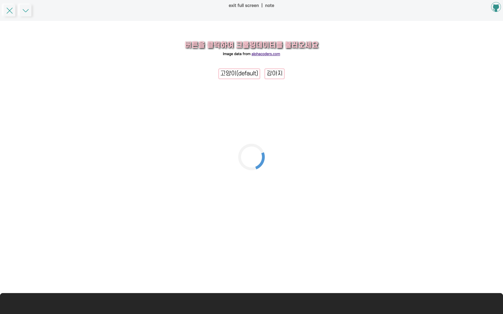

**스플래시 화면**과 **데이터 로딩 창**을 구현한 크롤링이미지 열람 어플리케이션

크롤링은 [소마법 프로젝트 - 4 (crawling)](https://taeny.dev/project/%EC%86%8C%EB%A7%88%EB%B2%95-%ED%94%84%EB%A1%9C%EC%A0%9D%ED%8A%B84/)에 있는 크롤링 함수를 재사용하였다.

<hr/>

```toc
exclude: Table of Contents
from-heading: 1
to-heading: 5
```

# \#. Project Map

- :apple: <a href="https://small-magic-project.now.sh/" target="_blank">프로젝트 사이트</a>

- :apple: <a href="https://small-magic-project.now.sh/loading" target="_blank">프로젝트 사이트/loading</a>

* :fire: <a href="https://github.com/taenykim/small-magic-project" target="_blank">프로젝트 깃허브소스</a>

<br/>

<details>
<summary>제작노트 한눈에보기[접기/펼치기]</summary>
<div markdown="1">

- [소마법 프로젝트 - 1 (container)](https://taeny.dev/project/%EC%86%8C%EB%A7%88%EB%B2%95-%ED%94%84%EB%A1%9C%EC%A0%9D%ED%8A%B81/)

- [소마법 프로젝트 - 2 (calculator)](https://taeny.dev/project/%EC%86%8C%EB%A7%88%EB%B2%95-%ED%94%84%EB%A1%9C%EC%A0%9D%ED%8A%B82/)

- [소마법 프로젝트 - 3 (graph)](https://taeny.dev/project/%EC%86%8C%EB%A7%88%EB%B2%95-%ED%94%84%EB%A1%9C%EC%A0%9D%ED%8A%B83/)

- [소마법 프로젝트 - 4 (crawling)](https://taeny.dev/project/%EC%86%8C%EB%A7%88%EB%B2%95-%ED%94%84%EB%A1%9C%EC%A0%9D%ED%8A%B84/)

- [소마법 프로젝트 - 5 (today)](https://taeny.dev/project/%EC%86%8C%EB%A7%88%EB%B2%95-%ED%94%84%EB%A1%9C%EC%A0%9D%ED%8A%B85/)

- [소마법 프로젝트 - 6 (jjal)](https://taeny.dev/project/%EC%86%8C%EB%A7%88%EB%B2%95-%ED%94%84%EB%A1%9C%EC%A0%9D%ED%8A%B86/)

- [소마법 프로젝트 - 7 (avengers)](https://taeny.dev/project/%EC%86%8C%EB%A7%88%EB%B2%95-%ED%94%84%EB%A1%9C%EC%A0%9D%ED%8A%B87/)

- [소마법 프로젝트 - 8 (maskmap)](https://taeny.dev/project/%EC%86%8C%EB%A7%88%EB%B2%95-%ED%94%84%EB%A1%9C%EC%A0%9D%ED%8A%B88/)

- [소마법 프로젝트 - 9 (loading)](https://taeny.dev/project/%EC%86%8C%EB%A7%88%EB%B2%95-%ED%94%84%EB%A1%9C%EC%A0%9D%ED%8A%B89/)

- [소마법 프로젝트 - 10 (lazyloading)](https://taeny.dev/project/%EC%86%8C%EB%A7%88%EB%B2%95-%ED%94%84%EB%A1%9C%EC%A0%9D%ED%8A%B810/)
  </div>
  </details>

# 1. 레이아웃

## 1-1. 스플래시 화면


> LOADING 텍스트에 애니메이션을 주었다.

## 1-2. 데이터 로딩화면



> 회전하는 원형 엘리먼트 애니메이션..

## 1-3. 데이터 로딩완료화면


> "Hello cats!"

## 1-4. 컴포넌트

```jsx
<BackgroundContainer>
  <ContentsMenubar name="loading" />
  <MainLoader id="main_loader">
    <MainLoaderText transX="12px" delay="0.35s" color="firebrick">
      LOADING
    </MainLoaderText>
    <MainLoaderText transX="10px" delay="0.28s" color="darkgoldenrod">
      LOADING
    </MainLoaderText>
    <MainLoaderText transX="8px" delay="0.21s" color="darkolivegreen">
      LOADING
    </MainLoaderText>
    <MainLoaderText transX="6px" delay="0.14s" color="darksalmon">
      LOADING
    </MainLoaderText>
    <MainLoaderText transX="4px" delay="0.07s" color="cornflowerblue">
      LOADING
    </MainLoaderText>
    <MainLoaderText delay="0s" color="white">
      LOADING
    </MainLoaderText>
  </MainLoader>
  <Loader id="first_loader"></Loader>
  <Description>
    <p
      style={{
        fontSize: '20px',
        fontFamily: 'escore7',
        color: 'pink',
        textShadow: '2px 2px 4px black',
        textAlign: 'center',
      }}
    >
      버튼을 클릭하여 크롤링데이터를 불러오세요
    </p>
    <p style={{ fontSize: '10px', fontFamily: 'escore5', marginTop: '10px' }}>
      Image data from{'  '}
      <a href="https://wall.alphacoders.com/" target="_blank">
        alphacoders.com
      </a>
    </p>
  </Description>
  <ButtonContainer>
    <button id="cat_button">고양이(default)</button>
    <button id="dog_button">강아지</button>
  </ButtonContainer>
  <TextContainer id="myDiv" style={{ display: 'none' }}>
    {imgArr.map((item, i) => {
      return </img>
    })}
  </TextContainer>
</BackgroundContainer>
```

모든 컴포넌트는 `styled-component`로 구성하였다.

1. **MainLoader**, **MainLoaderText** : 스플래시 로딩화면

> 한눈에 보기 좋지 않아서 코드스플리팅이 필요해보임 ㅠㅠ setTimeout() 메소드로 3초간 지속되게 해주었다.

2. **Loader** : 데이터 로딩화면

> 로딩화면은 div 태그로 구성했고 fetch의 then 체이닝으로 데이터가 불러와지면 로딩화면이 사라지고 데이터이미지가 보여지도록 해주었다.

3. **Description** : 설명창

> 어플리케이션 설명 창

4. **ButtonContainer** : 크롤링 함수 실행버튼

> 고양이와 강아지 이미지를 불러오는 크롤링함수를 실행하는 버튼 2개 Container

5. **TextContainer** : 이미지 데이터 뷰 Container

> 크롤링한 고양이와 강아지 이미지데이터를 보여주는 뷰 Container

> 초기 style 값으로 `display:none`을 설정해주었다.

# 2. 상태관리

```js
const [imgLoadToggle, setImgLoadToggle] = useState(false)
const [imgArr, setImgArr] = useState([])
```

상태관리는 리액트 hooks를 이용했다.

1. **imgLoadToggle** : 초기로딩 판별 변수

> 초기 DOM 로드시, 한번만 크롤링 함수를 실행하기 위해 boolean 변수를 두었다.

2. **imgArr** : 이미지가 저장될 배열

> 크롤링된 이미지 데이터들이 저장되는 배열

# 3. 로딩바

## 3-1. 스플래시

웹페이지 초기 진입시, 실행되는 스플래시 화면.

```js
const showFull = () => {
  document.getElementById('main_loader').style.display = 'none'
}
```

```js
useEffect(() => {
  if (!imgLoadToggle) {
    crawling('cat')
    setImgLoadToggle(true)
    setTimeout(showFull, 3000)
  }
})
```

useEffect로 DOM이 로드되면 setTimeout()으로 3초간 스플래시 화면이 실행되도록 해주었다.

3초가 지나면, main_loader 엘리먼트를 display:none 하였다.

그리고 `setImgLoadToggle(true)`를 실행하도록 했다.

## 3-2. 로딩바

```js
document.getElementById('cat_button').addEventListener('click', e => {
  e.stopImmediatePropagation()
  loadPage()
  crawling('cat')
})
document.getElementById('dog_button').addEventListener('click', e => {
  e.stopImmediatePropagation()
  loadPage()
  crawling('dog')
})
```

우선 click 이벤트 핸들러 등록하고 세개의 함수 및 메소드를 실행케 하였다.

<hr/>

### :apple: e.stopImmediatePropagation()

```js
event.preventDefault()
// 현재 이벤트의 기본 동작을 중단합니다.

event.stopPropagation()
// 현재 이벤트가 상위로 전파되지 않도록 중단합니다.

event.stopImmediatePropagation()
// 현재 이벤트가 상위뿐 아니라 현재 레벨에 걸린 다른 이벤트도 동작하지 않도록 합니다.
```

출처: [https://programmingsummaries.tistory.com/313](https://programmingsummaries.tistory.com/313)

**중요**

useEffect가 여러번 실행되며 addEventListener도 여러번 실행되서 크롤링함수가 여러번 실행되었다.

그래서 `stopImmediatePropagation()` 를 통해 동일 함수를 한번만 실행하게끔 해주었다.

<hr/>

### 페이지 컨트롤 loadPage(), showPage()

```js
const loadPage = () => {
  document.getElementById('first_loader').style.display = 'block'
  document.getElementById('myDiv').style.display = 'none'
}
const showPage = () => {
  document.getElementById('first_loader').style.display = 'none'
  document.getElementById('myDiv').style.display = 'flex'
}
```

크롤링 함수 시작시 `loadPage()`를 실행하고, 데이터를 불러오면 `showPage()`를 실행하게 하였다.

각각의 함수를 통해 로딩바 엘리먼트와 데이터 뷰 엘리먼트 display를 조정해주었다.

<hr/>

### crawling()

AJAX는 fetch를 사용했고, 비동기 처리는 then 메소드 체이닝을 사용했다.

크롤링함수도 이전에 배경화면 크롤링 어플리케이션의 crawling()함수를 재사용하였다.

[소마법 프로젝트 - 4 (crawling)](https://taeny.dev/project/%EC%86%8C%EB%A7%88%EB%B2%95-%ED%94%84%EB%A1%9C%EC%A0%9D%ED%8A%B84/)

```js
fetch(url)
  .then //...
  ()
  .then(json => {
    setImgArr(json)
    showPage()
  })
```

그리고 데이터가 모두 읽어지면, hooks를 통해 imgArr에 이미지들을 저장하고 showPage()를 실행하도록 하였다.

<hr/>

# 4. css 애니메이션

css 애니메이션은 styled-components와 keyframes를 이용했다.

`스플래시 화면`, `데이터 로딩바`, `이미지 컨테이너 뷰` 총 3개의 엘리먼트에 애니메이션을 주었다.

## 4-1. 스플래시 애니메이션

> 키프레임

```js
const customAni = keyframes`
0%, 100% {
  transform: translatey(0); 
 }
 50% {
  transform: translatey(20px);
 }
`
```

> 스타일

```js
const MainLoaderText = styled.div`
  position: absolute;
  font-size: 32px;
  text-shadow: 2px 2px 4px black;
  font-family: escore9;
  color: ${props => {
    return props.color
  }};
  animation: ${customAni} 1.5s ease-in-out infinite;
  animation-delay: ${props => {
    return props.delay
  }};
  margin-left: ${props => {
    return props.transX
  }};
`
```

> 컴포넌트

```jsx
<MainLoaderText transX="12px" delay="0.35s" color="firebrick">
  LOADING
</MainLoaderText>
```

styled-components 의 props로 transX, delay, color를 넣어주었다.

그리고 animation은 `transform: translatey()`를 사용했다.

<hr/>

## 4-2. 로딩바 애니메이션

> 키프레임

```js
const spin = keyframes`
  0% {
    transform: translate(-50%, -50%) rotate(0deg);
  }
  100% {
    transform: translate(-50%, -50%) rotate(360deg);
  }
`
```

> 스타일

```js
const Loader = styled.div`
  position: fixed;
  top: 50%;
  left: 50%;
  border: 8px solid #f3f3f3;
  border-top: 8px solid #3498db;
  border-radius: 50%;
  width: 60px;
  height: 60px;
  transform: translate(-50%, -50%);
  animation: ${spin} 2s linear infinite;
`
```

> 컴포넌트

```js
<Loader id="first_loader"></Loader>
```

먼저 **top:50%, left:50%**와 **transform: translate(-50%, -50%)**를 통하여 엘리먼트가 화면 중앙에 오게 하였다.

그리고 animation은 `transform: rotate()`를 사용했다.

<hr/>

## 4-3. 이미지 컨테이너 뷰

> 키프레임

```js
const positionbottom = keyframes`
  from{ margin-top:150px; opacity:0 } 
  to{ margin-top:100px; opacity:1 }
`
```

> 스타일

```js
const TextContainer = styled.div`
  margin-top: 100px;
  width: 100vw;
  justify-content: center;
  flex-wrap: wrap;
  animation: ${positionbottom} 1s linear;
`
```

> 컴포넌트

```js
<TextContainer id="myDiv" style={{ display: 'none' }}>
  {imgArr.map((item, i) => {
    return </img>
  })}
</TextContainer>
```

<hr/>

animation은 margin값과 opacity를 사용해서 자연스럽게 스르륵 올라오는 효과를 주었다.

# 5. 개인적인 피드백

## 5-1. lazy loading X

[소마법 프로젝트 - 10 (lazyloading)](https://taeny.dev/project/%EC%86%8C%EB%A7%88%EB%B2%95-%ED%94%84%EB%A1%9C%EC%A0%9D%ED%8A%B810/)
